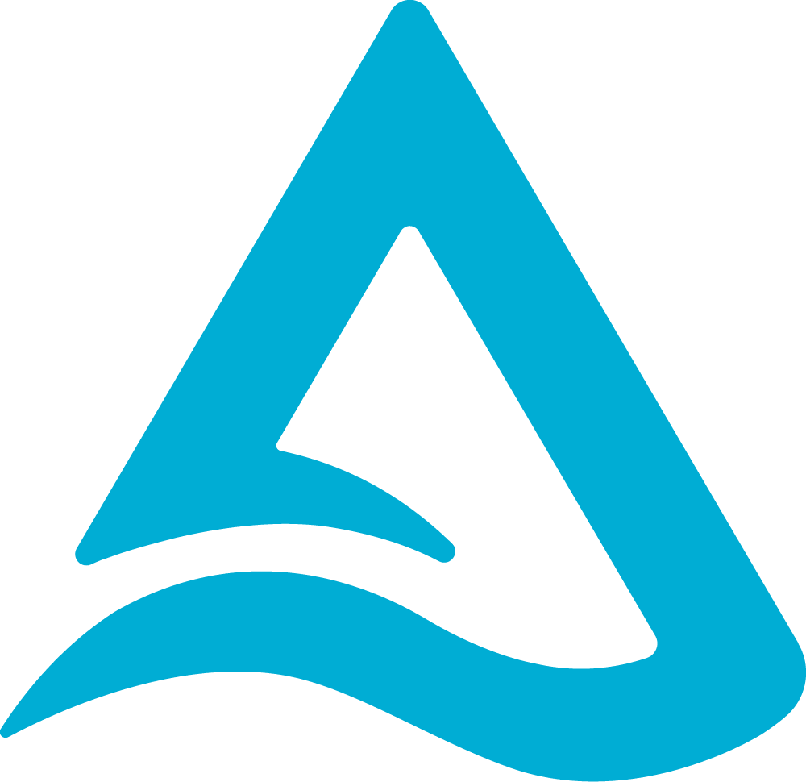
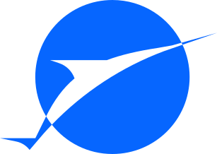

<div class="ll-home" markdown>

# Speed Up Data Lake Queries

```sh
curl https://lakelet.dev/install.sh | sh
```

Shell only support for Linux and macOS. For Windows, you have to grab a build from
[releases/nightly](https://github.com/Smith-Cruise/Lakelet/releases/tag/nightly).

[Getting Started](getting-started.md){ .md-button .md-button--primary }

## Two ways to query

<div class="ll-query-modes" markdown>

<div class="ll-query-mode" markdown>

<div class="ll-query-mode__copy" markdown>

<div class="ll-query-mode__identity">
  <span class="ll-query-mode__icon" aria-hidden="true">
    <svg viewBox="0 0 24 24" fill="none" stroke="currentColor" stroke-width="2" stroke-linecap="round" stroke-linejoin="round">
      <polyline points="4 17 10 11 4 5"></polyline>
      <line x1="12" x2="20" y1="19" y2="19"></line>
    </svg>
  </span>
  <span class="ll-query-mode__kicker">TERMINAL</span>
</div>

### CLI

Query lake tables directly from your terminal.

[CLI quick start :lucide-arrow-right:](getting-started.md#start-lakelet-cli){ .ll-query-link }

</div>

</div>

<div class="ll-query-mode" markdown>

<div class="ll-query-mode__copy" markdown>

<div class="ll-query-mode__identity">
  <span class="ll-query-mode__icon" aria-hidden="true">
    <svg viewBox="0 0 24 24" fill="none" stroke="currentColor" stroke-width="2" stroke-linecap="round" stroke-linejoin="round">
      <rect width="20" height="8" x="2" y="2" rx="2" ry="2"></rect>
      <rect width="20" height="8" x="2" y="14" rx="2" ry="2"></rect>
      <line x1="6" x2="6.01" y1="6" y2="6"></line>
      <line x1="6" x2="6.01" y1="18" y2="18"></line>
    </svg>
  </span>
  <span class="ll-query-mode__kicker">SERVER</span>
</div>

### Flight SQL Server

Serve Arrow-native query results to ADBC clients and applications.

[Flight SQL Server guide :lucide-arrow-right:](getting-started.md#arrow-flight-sql-server){ .ll-query-link }

</div>

</div>

</div>

## One engine across your lake

<div class="ll-lake-architecture" markdown>

<div class="ll-architecture-group ll-architecture-catalogs" markdown>
<span class="ll-architecture-label">CATALOGS</span>
<div class="ll-architecture-nodes" markdown>
<div class="ll-architecture-node ll-architecture-node--catalog">

</div>
<div class="ll-architecture-node ll-architecture-node--catalog">

</div>
</div>

</div>

<div class="ll-architecture-arrow ll-architecture-arrow--down" aria-hidden="true" markdown>
<i></i>
</div>

<div class="ll-architecture-engine" markdown>
<strong>Lakelet</strong>

</div>

<div class="ll-architecture-arrow ll-architecture-arrow--down" aria-hidden="true" markdown>
<i></i>
</div>

<div class="ll-architecture-group ll-architecture-formats" markdown>
<span class="ll-architecture-label">TABLE FORMATS</span>
<div class="ll-architecture-nodes" markdown>
<div class="ll-architecture-node">

</div>
<div class="ll-architecture-node">

</div>
<div class="ll-architecture-node">

</div>
<div class="ll-architecture-node ll-architecture-node--hive">

</div>
</div>

</div>

</div>

</div>
