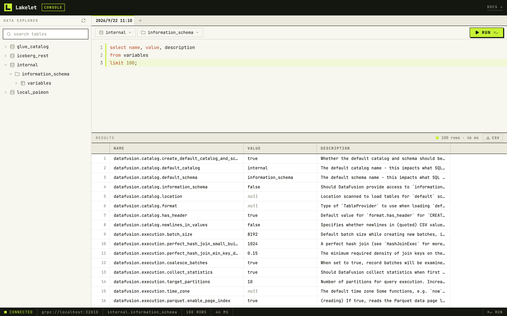

<div class="ll-home" markdown>

<div class="ll-band ll-hero" markdown>

<span class="ll-kicker">DATAFUSION · RUST · ARROW</span>

# Speed Up Data Lake Queries

<p class="ll-lead">One engine across Iceberg, Delta Lake, Paimon and Hive. A single binary, no JVM, no cluster to stand up.</p>

[Getting Started](getting-started.md){ .md-button .md-button--primary }
[View on GitHub](https://github.com/Smith-Cruise/Lakelet){ .md-button }

</div>

<div class="ll-install" markdown>

```sh
curl -fsSL https://lakelet.dev/install.sh | sh
```

</div>

<p class="ll-note">The shell installer supports Linux and macOS. For Windows, grab a build from
<a href="https://github.com/Smith-Cruise/Lakelet/releases/tag/nightly">releases/nightly</a>.</p>

<div class="ll-section" markdown>

<span class="ll-eyebrow">Interfaces</span>

## Two ways to query

<p class="ll-sub">The same engine behind both, reading the same catalogs. Pick whichever fits how you work.</p>

<div class="ll-modes" markdown>

<div class="ll-mode" markdown>

<div class="ll-mode__id">
  <span class="ll-mode__icon" aria-hidden="true">
    <svg viewBox="0 0 24 24" fill="none" stroke="currentColor" stroke-width="2.4" stroke-linecap="square" stroke-linejoin="miter">
      <rect width="20" height="7" x="2" y="3"></rect>
      <rect width="20" height="7" x="2" y="14"></rect>
      <line x1="6" x2="6.01" y1="6.5" y2="6.5"></line>
      <line x1="6" x2="6.01" y1="17.5" y2="17.5"></line>
    </svg>
  </span>
  <span class="ll-eyebrow">Server</span>
</div>

### Server

Serve Arrow Flight SQL to ADBC clients, with a built-in web console on the same port.

[See the console →](#query-from-the-browser){ .ll-mode__go }

</div>

<div class="ll-mode" markdown>

<div class="ll-mode__id">
  <span class="ll-mode__icon" aria-hidden="true">
    <svg viewBox="0 0 24 24" fill="none" stroke="currentColor" stroke-width="2.4" stroke-linecap="square" stroke-linejoin="miter">
      <polyline points="4 17 10 11 4 5"></polyline>
      <line x1="12" x2="20" y1="19" y2="19"></line>
    </svg>
  </span>
  <span class="ll-eyebrow">Terminal</span>
</div>

### CLI

Query lake tables directly from your terminal. Point it at a catalog and start typing SQL.

[See a session →](#query-from-the-cli){ .ll-mode__go }

</div>

</div>

</div>

<div class="ll-section" markdown>

<span class="ll-eyebrow">Coverage</span>

## One engine across your lake

<p class="ll-sub">A metastore-backed catalog reads whichever format each table declares. The two single-format catalogs serve exactly what their name says.</p>

<div class="ll-matrix" markdown>

<table class="ll-matrix-table">
<thead>
<tr><th>Catalog</th><th>Iceberg</th><th>Delta Lake</th><th>Paimon</th><th>Hive</th></tr>
</thead>
<tbody>
<tr>
  <th> Hive Metastore</th>
  <td><span class="ll-yes" title="Supported"><svg viewBox="0 0 24 24" fill="none" stroke="currentColor" stroke-width="3.4" stroke-linecap="square" stroke-linejoin="miter"><polyline points="20 6 9 17 4 12"></polyline></svg></span></td>
  <td><span class="ll-beta" title="Experimental">β</span></td>
  <td><span class="ll-yes" title="Supported"><svg viewBox="0 0 24 24" fill="none" stroke="currentColor" stroke-width="3.4" stroke-linecap="square" stroke-linejoin="miter"><polyline points="20 6 9 17 4 12"></polyline></svg></span></td>
  <td><span class="ll-yes" title="Supported"><svg viewBox="0 0 24 24" fill="none" stroke="currentColor" stroke-width="3.4" stroke-linecap="square" stroke-linejoin="miter"><polyline points="20 6 9 17 4 12"></polyline></svg></span></td>
</tr>
<tr>
  <th> AWS Glue</th>
  <td><span class="ll-yes" title="Supported"><svg viewBox="0 0 24 24" fill="none" stroke="currentColor" stroke-width="3.4" stroke-linecap="square" stroke-linejoin="miter"><polyline points="20 6 9 17 4 12"></polyline></svg></span></td>
  <td><span class="ll-beta" title="Experimental">β</span></td>
  <td><span class="ll-yes" title="Supported"><svg viewBox="0 0 24 24" fill="none" stroke="currentColor" stroke-width="3.4" stroke-linecap="square" stroke-linejoin="miter"><polyline points="20 6 9 17 4 12"></polyline></svg></span></td>
  <td><span class="ll-yes" title="Supported"><svg viewBox="0 0 24 24" fill="none" stroke="currentColor" stroke-width="3.4" stroke-linecap="square" stroke-linejoin="miter"><polyline points="20 6 9 17 4 12"></polyline></svg></span></td>
</tr>
<tr>
  <th> Iceberg REST</th>
  <td><span class="ll-yes" title="Supported"><svg viewBox="0 0 24 24" fill="none" stroke="currentColor" stroke-width="3.4" stroke-linecap="square" stroke-linejoin="miter"><polyline points="20 6 9 17 4 12"></polyline></svg></span></td>
  <td><span class="ll-no">—</span></td>
  <td><span class="ll-no">—</span></td>
  <td><span class="ll-no">—</span></td>
</tr>
<tr>
  <th> Paimon FileSystem</th>
  <td><span class="ll-no">—</span></td>
  <td><span class="ll-no">—</span></td>
  <td><span class="ll-yes" title="Supported"><svg viewBox="0 0 24 24" fill="none" stroke="currentColor" stroke-width="3.4" stroke-linecap="square" stroke-linejoin="miter"><polyline points="20 6 9 17 4 12"></polyline></svg></span></td>
  <td><span class="ll-no">—</span></td>
</tr>
</tbody>
</table>

</div>

<p class="ll-legend">
<span><span class="ll-yes" aria-hidden="true"><svg viewBox="0 0 24 24" fill="none" stroke="currentColor" stroke-width="3.4" stroke-linecap="square" stroke-linejoin="miter"><polyline points="20 6 9 17 4 12"></polyline></svg></span> Supported</span>
<span><span class="ll-beta" aria-hidden="true">β</span> Experimental</span>
<span><span class="ll-no" aria-hidden="true">—</span> Not served by this catalog</span>
</p>

</div>

<div class="ll-section" markdown>

<span class="ll-eyebrow">Console</span>

## Query from the browser

<p class="ll-sub">Run the server and it serves a web console on the same port as Flight SQL — catalog explorer, SQL editor and results, no extra process.</p>

<div class="ll-shot">

</div>

<span class="ll-caption">lakelet --config config.toml --server · http://localhost:32010</span>

[Server guide →](server.md){ .ll-go }

</div>

<div class="ll-section" markdown>

<span class="ll-eyebrow">Terminal</span>

## Query from the CLI

<p class="ll-sub">The same binary, started without <code>--server</code>, is a SQL shell. Pick a catalog,
type a statement, end it with a semicolon.</p>

<div class="ll-term">
<div class="ll-term__bar">
<span class="ll-term__dots" aria-hidden="true"></span>
<div class="ll-switch" role="tablist" aria-label="CLI examples">
<button class="ll-switch__tab" type="button" role="tab" id="cli-tab-explore" aria-controls="cli-panel-explore" aria-selected="true">Explore</button>
<button class="ll-switch__tab" type="button" role="tab" id="cli-tab-query" aria-controls="cli-panel-query" aria-selected="false" tabindex="-1">Query</button>
<button class="ll-switch__tab" type="button" role="tab" id="cli-tab-script" aria-controls="cli-panel-script" aria-selected="false" tabindex="-1">Script</button>
</div>
</div>
<div class="ll-term__body">
<pre class="ll-term__panel" id="cli-panel-explore" role="tabpanel" aria-labelledby="cli-tab-explore" tabindex="0"><span class="ll-t-dim">$</span> <span class="ll-t-cmd">./lakelet --config config.toml</span>
<span class="ll-t-dim">Enter SQL ending with &#x27;;&#x27;. Type &#x27;quit;&#x27; to disconnect.</span>
<span class="ll-t-gap"></span>
<span class="ll-t-p">sql&gt; </span><span class="ll-t-kw">show catalogs</span>;
<span class="ll-t-box">╭──────────────┬──────────────╮</span>
<span class="ll-t-box">│</span><span class="ll-t-h"> catalog_name </span><span class="ll-t-box">│</span><span class="ll-t-h"> catalog_type </span><span class="ll-t-box">│</span>
<span class="ll-t-box">╞══════════════╪══════════════╡</span>
<span class="ll-t-box">│</span> glue_catalog <span class="ll-t-box">│</span> GLUE         <span class="ll-t-box">│</span>
<span class="ll-t-box">├──────────────┼──────────────┤</span>
<span class="ll-t-box">│</span> iceberg_rest <span class="ll-t-box">│</span> ICEBERG-REST <span class="ll-t-box">│</span>
<span class="ll-t-box">├──────────────┼──────────────┤</span>
<span class="ll-t-box">│</span> internal     <span class="ll-t-box">│</span> INTERNAL     <span class="ll-t-box">│</span>
<span class="ll-t-box">╰──────────────┴──────────────╯</span>
<span class="ll-t-dim">3 row(s) fetched. </span>
<span class="ll-t-dim">Elapsed 0.004 seconds.</span>
<span class="ll-t-gap"></span>
<span class="ll-t-p">sql&gt; </span><span class="ll-t-kw">use</span> glue_catalog.tpch_sf300;
<span class="ll-t-dim">0 row(s) fetched. </span>
<span class="ll-t-dim">Elapsed 0.001 seconds.</span>
<span class="ll-t-gap"></span>
<span class="ll-t-p">sql&gt; </span><span class="ll-t-kw">show tables</span>;
<span class="ll-t-box">╭────────────╮</span>
<span class="ll-t-box">│</span><span class="ll-t-h"> table_name </span><span class="ll-t-box">│</span>
<span class="ll-t-box">╞════════════╡</span>
<span class="ll-t-box">│</span> customer   <span class="ll-t-box">│</span>
<span class="ll-t-box">├────────────┤</span>
<span class="ll-t-box">│</span> lineitem   <span class="ll-t-box">│</span>
<span class="ll-t-box">├────────────┤</span>
<span class="ll-t-box">│</span> orders     <span class="ll-t-box">│</span>
<span class="ll-t-box">╰────────────╯</span>
<span class="ll-t-dim">3 row(s) fetched. </span>
<span class="ll-t-dim">Elapsed 0.088 seconds.</span></pre>
<pre class="ll-term__panel" id="cli-panel-query" role="tabpanel" aria-labelledby="cli-tab-query" tabindex="0" hidden><span class="ll-t-p">sql&gt; </span><span class="ll-t-kw">select</span>
<span class="ll-t-p">  -&gt; </span>  o_orderpriority,
<span class="ll-t-p">  -&gt; </span>  <span class="ll-t-kw">count</span>(*) <span class="ll-t-kw">as</span> orders,
<span class="ll-t-p">  -&gt; </span>  <span class="ll-t-kw">round</span>(<span class="ll-t-kw">avg</span>(o_totalprice), 2) <span class="ll-t-kw">as</span> avg_price
<span class="ll-t-p">  -&gt; </span><span class="ll-t-kw">from</span> orders
<span class="ll-t-p">  -&gt; </span><span class="ll-t-kw">where</span> o_orderdate &gt;= <span class="ll-t-kw">date</span> &#x27;1998-01-01&#x27;
<span class="ll-t-p">  -&gt; </span><span class="ll-t-kw">group by</span> o_orderpriority
<span class="ll-t-p">  -&gt; </span><span class="ll-t-kw">order by</span> o_orderpriority;
<span class="ll-t-box">╭─────────────────┬─────────┬───────────╮</span>
<span class="ll-t-box">│</span><span class="ll-t-h"> o_orderpriority </span><span class="ll-t-box">│</span><span class="ll-t-h"> orders  </span><span class="ll-t-box">│</span><span class="ll-t-h"> avg_price </span><span class="ll-t-box">│</span>
<span class="ll-t-box">╞═════════════════╪═════════╪═══════════╡</span>
<span class="ll-t-box">│</span> 1-URGENT        <span class="ll-t-box">│</span> 5763412 <span class="ll-t-box">│</span> 151243.77 <span class="ll-t-box">│</span>
<span class="ll-t-box">├─────────────────┼─────────┼───────────┤</span>
<span class="ll-t-box">│</span> 2-HIGH          <span class="ll-t-box">│</span> 5761905 <span class="ll-t-box">│</span> 151198.02 <span class="ll-t-box">│</span>
<span class="ll-t-box">├─────────────────┼─────────┼───────────┤</span>
<span class="ll-t-box">│</span> 3-MEDIUM        <span class="ll-t-box">│</span> 5764880 <span class="ll-t-box">│</span> 151322.41 <span class="ll-t-box">│</span>
<span class="ll-t-box">├─────────────────┼─────────┼───────────┤</span>
<span class="ll-t-box">│</span> 4-NOT SPECIFIED <span class="ll-t-box">│</span> 5762233 <span class="ll-t-box">│</span> 151176.95 <span class="ll-t-box">│</span>
<span class="ll-t-box">├─────────────────┼─────────┼───────────┤</span>
<span class="ll-t-box">│</span> 5-LOW           <span class="ll-t-box">│</span> 5763004 <span class="ll-t-box">│</span> 151259.63 <span class="ll-t-box">│</span>
<span class="ll-t-box">╰─────────────────┴─────────┴───────────╯</span>
<span class="ll-t-dim">5 row(s) fetched. </span>
<span class="ll-t-dim">Elapsed 2.184 seconds.</span>
<span class="ll-t-gap"></span>
<span class="ll-t-p">sql&gt; </span><span class="ll-t-kw">select</span> * <span class="ll-t-kw">from</span> lineitm <span class="ll-t-kw">limit</span> 5;
<span class="ll-t-err">Error during planning: table &#x27;glue_catalog.tpch_sf300.lineitm&#x27; not found</span>
<span class="ll-t-gap"></span>
<span class="ll-t-p">sql&gt; </span><span class="ll-t-kw">quit</span>;
<span class="ll-t-dim">Goodbye!</span></pre>
<pre class="ll-term__panel" id="cli-panel-script" role="tabpanel" aria-labelledby="cli-tab-script" tabindex="0" hidden><span class="ll-t-dim">$</span> <span class="ll-t-cmd">./lakelet --version</span>
Lakelet: compiled with a0f747f 2026-09-21 13:47:20 UTC
<span class="ll-t-gap"></span>
<span class="ll-t-dim">$</span> <span class="ll-t-cmd">./lakelet --config config.toml --command &quot;show catalogs;&quot;</span>
<span class="ll-t-box">+--------------+--------------+</span>
<span class="ll-t-box">|</span><span class="ll-t-h"> catalog_name </span><span class="ll-t-box">|</span><span class="ll-t-h"> catalog_type </span><span class="ll-t-box">|</span>
<span class="ll-t-box">+--------------+--------------+</span>
<span class="ll-t-box">|</span> glue_catalog <span class="ll-t-box">|</span> GLUE         <span class="ll-t-box">|</span>
<span class="ll-t-box">|</span> iceberg_rest <span class="ll-t-box">|</span> ICEBERG-REST <span class="ll-t-box">|</span>
<span class="ll-t-box">|</span> internal     <span class="ll-t-box">|</span> INTERNAL     <span class="ll-t-box">|</span>
<span class="ll-t-box">+--------------+--------------+</span>
<span class="ll-t-dim">3 row(s) fetched. </span>
<span class="ll-t-dim">Elapsed 0.004 seconds.</span>
<span class="ll-t-gap"></span>
<span class="ll-t-dim">$</span> <span class="ll-t-cmd">cat daily.sql</span>
<span class="ll-t-kw">use</span> glue_catalog.tpch_sf300;
<span class="ll-t-kw">select</span> <span class="ll-t-kw">count</span>(*) <span class="ll-t-kw">as</span> n_orders <span class="ll-t-kw">from</span> orders;
<span class="ll-t-gap"></span>
<span class="ll-t-dim">$</span> <span class="ll-t-cmd">./lakelet --config config.toml --file daily.sql</span>
<span class="ll-t-dim">0 row(s) fetched. </span>
<span class="ll-t-dim">Elapsed 0.001 seconds.</span>
<span class="ll-t-gap"></span>
<span class="ll-t-box">+-----------+</span>
<span class="ll-t-box">|</span><span class="ll-t-h"> n_orders  </span><span class="ll-t-box">|</span>
<span class="ll-t-box">+-----------+</span>
<span class="ll-t-box">|</span> 450000000 <span class="ll-t-box">|</span>
<span class="ll-t-box">+-----------+</span>
<span class="ll-t-dim">1 row(s) fetched. </span>
<span class="ll-t-dim">Elapsed 1.204 seconds.</span></pre>
</div>
</div>

<span class="ll-caption">./lakelet --config config.toml</span>

[CLI quick start →](getting-started.md#start-lakelet-cli){ .ll-go }

</div>

<div class="ll-band ll-close" markdown>

## Start querying

`curl -fsSL https://lakelet.dev/install.sh | sh`

<span class="ll-colophon">Apache-2.0 · Built on Apache DataFusion &amp; Arrow</span>

</div>

</div>
